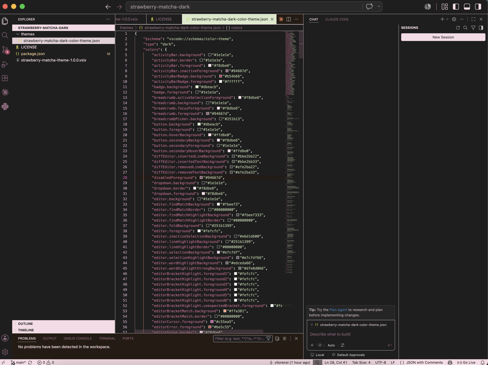

# 🍓 Strawberry Matcha Dark

A cozy dark VS Code theme inspired by strawberry pink and matcha green, designed for beautiful and comfortable coding.

## ✨ Features

- 🍓 Soft strawberry pink syntax highlighting
- 🍵 Matcha green accents
- 🌙 Dark background for reduced eye strain
- 💻 Optimized for everyday coding

## 📦 Installation

1. Open Extensions in VS Code.
2. Search **Strawberry Matcha Dark**.
3. Click **Install**.
4. Select **Strawberry Matcha Dark** from Color Theme.

## 🔗 Links

- [VS Code Marketplace](https://marketplace.visualstudio.com/items?itemName=tipandtale.tipandtale-strawberry-matcha-dark)
- [GitHub Repository](https://github.com/vidella/strawberry-matcha-dark-theme)

---

Made with 🍓 by tipandtale.

---

If you enjoy this theme, consider ⭐ starring the theme!